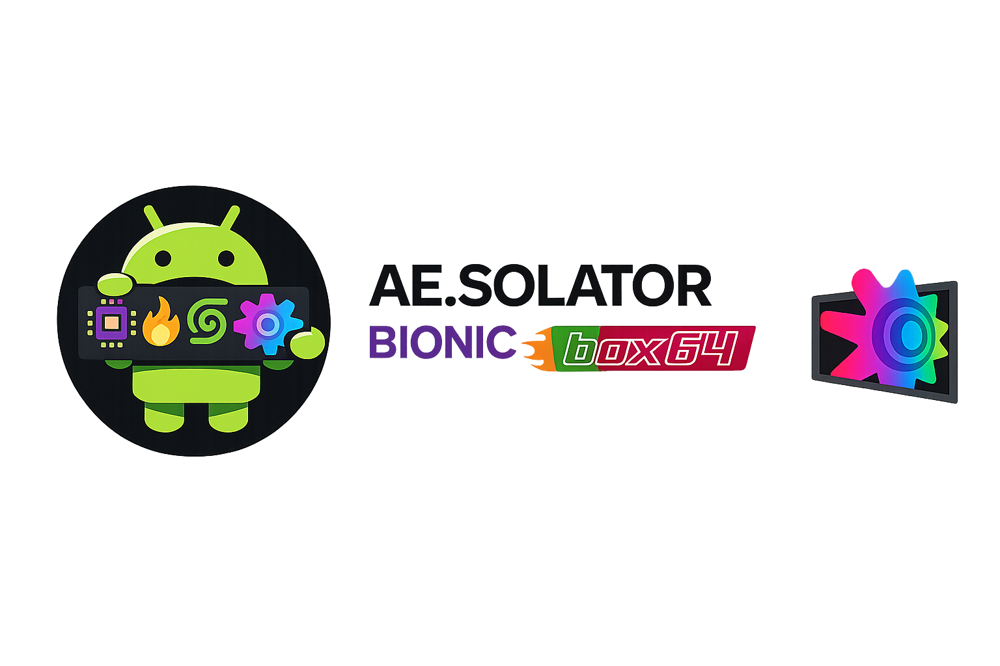
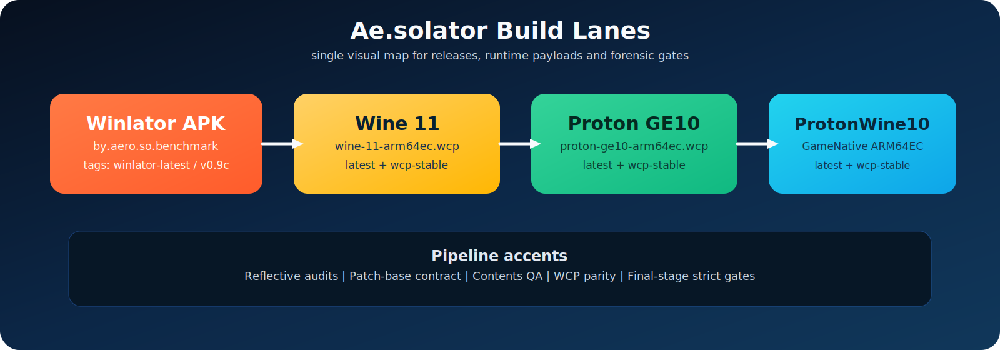

<p align="center">
  
</p>
<p align="center">
  
</p>
<p align="center">
  
  
  
  
</p>

# Ae.solator

**RU:** Авторский форк Winlator/Ludashi для ARM64EC + FEXCore + WCP-потока, с форензикой и воспроизводимым CI.

**EN:** Author fork of Winlator/Ludashi for ARM64EC + FEXCore + WCP workflow, with forensic tooling and reproducible CI.

- **App package / Пакет приложения:** `by.aero.so.benchmark`
- **Main branch / Основная ветка:** `main`
- **Current line / Текущая линейка:** `0.9c+`

---

## Launch Deck / Панель запуска

| Build | Releases | Operations | Runtime board |
|---|---|---|---|
| [](ci/ci-build.sh) | [](https://github.com/kosoymiki/winlator-wine-proton-arm64ec-wcp/releases/tag/wcp-stable) | [](docs/CI_FAILURE_PLAYBOOK.md) | [](docs/HARVARD_RUNTIME_CONFLICT_BOARD.md) |
| [](ci/winlator/ci-build-winlator-ludashi.sh) | [](https://github.com/kosoymiki/winlator-wine-proton-arm64ec-wcp/releases/tag/winlator-latest) | [](docs/ADB_HARVARD_DEVICE_FORENSICS.md) | [](docs/REFLECTIVE_HARVARD_LEDGER.md) |

---

## Visual Build Matrix / Визуальная матрица сборок

<p align="center">
  
</p>

**RU:** Визуальная карта показывает четыре продуктовые линии и обязательные контрактные гейты перед релизом.  
**EN:** The visual map highlights four product lanes and mandatory contract gates before release.

---

## Artifacts & Releases / Артефакты и релизы

| Component | Artifact | Rolling Tag | Stable Line |
|---|---|---|---|
| Winlator APK | `by.aero.so.benchmark-*.apk` | `winlator-latest` | `v0.9c` |
| Wine 11 ARM64EC | `wine-11-arm64ec.wcp` | `wine-11-arm64ec-latest` | `wcp-stable` |
| Proton GE10 ARM64EC | `proton-ge10-arm64ec.wcp` | `proton-ge10-arm64ec-latest` | `wcp-stable` |
| ProtonWine10 GameNative ARM64EC | `protonwine10-gamenative-arm64ec.wcp` | `protonwine10-gamenative-arm64ec-latest` | `wcp-stable` |

**RU:** Rolling-теги обновляются последним успешным артефактом без дублей.  
**EN:** Rolling tags are updated with the latest successful artifact without duplicates.

---

## Quick Start / Быстрый старт

### Build WCP packages / Сборка WCP-пакетов

```bash
bash ci/ci-build.sh
bash ci/proton-ge10/ci-build-proton-ge10-wcp.sh
bash ci/protonwine10/ci-build-protonwine10-wcp.sh
```

### Build Winlator APK / Сборка Winlator APK

```bash
bash ci/winlator/ci-build-winlator-ludashi.sh
```

### Online reverse intake (no source clone) / Онлайн intake без скачивания исходников

```bash
ci/reverse/online-intake.sh
```

**RU:** Результаты сборки лежат в `out/`.  
**EN:** Build outputs are written to `out/`.

---

## Runtime & Contents Model / Модель runtime и contents

- **RU:** Для Wine/Proton контента используется этот репозиторий (GitHub Releases).
- **EN:** Wine/Proton content is sourced from this repository (GitHub Releases).
- **RU:** В UI Winlator они отображаются в совместимой группе `Wine/Proton`.
- **EN:** In Winlator UI they are displayed in a compatible `Wine/Proton` group.
- **RU:** Для Wine-family подгрупп показываются subtype-маркеры (`Proton`, `Proton GE`, `ProtonWine`) в строке метаданных и окне информации.
- **EN:** Wine-family subtype markers (`Proton`, `Proton GE`, `ProtonWine`) are shown in metadata rows and the content info dialog.
- **RU:** Пустые значения показываются честным placeholder `—`.
- **EN:** Empty values are represented by the honest placeholder `—`.

См./See:
- `docs/CONTENT_PACKAGES_ARCHITECTURE.md`
- `docs/CONTENTS_QA_CHECKLIST.md`

### Source Registry / База источников

| Package | Distribution source (`sourceRepo`) | Donor source (bionic baseline) | Registry files |
|---|---|---|---|
| `wine-11-arm64ec` | `kosoymiki/winlator-wine-proton-arm64ec-wcp` | `GameNative/proton-wine` (`build-20260225-1`) | `contents/contents.json`, `ci/runtime-sources/bionic-source-map.json` |
| `proton-ge10-arm64ec` | `kosoymiki/winlator-wine-proton-arm64ec-wcp` | `GameNative/proton-wine` (`build-20260225-1`) | `contents/contents.json`, `ci/runtime-sources/bionic-source-map.json` |
| `protonwine10-gamenative-arm64ec` | `kosoymiki/winlator-wine-proton-arm64ec-wcp` | `GameNative/proton-wine` (`build-20260225-1`) | `contents/contents.json`, `ci/runtime-sources/bionic-source-map.json` |

**RU:** Каноничный metadata-источник для выдачи в UI: `contents/contents.json` (`sourceRepo`, `releaseTag`).  
**EN:** Canonical UI-facing metadata source: `contents/contents.json` (`sourceRepo`, `releaseTag`).

---

## Diagnostics & Forensics / Диагностика и форензика

- `ci/winlator/forensic-adb-matrix.sh`
- `ci/winlator/forensic-adb-runtime-contract.sh`
- `ci/winlator/forensic-regression-local.sh`
- `ci/winlator/forensic-runtime-mismatch-matrix.py`
- `ci/winlator/selftest-runtime-mismatch-matrix.sh`
- `ci/validation/gh-mainline-health.sh`
- `ci/validation/gh-run-root-cause.sh`
- `ci/validation/collect-mainline-forensic-snapshot.sh`
- `docs/HARVARD_RUNTIME_CONFLICT_BOARD.md` (Trello-style runtime conflict board for multi-agent handoff)
- `ci/winlator/adb-logcat-winlator.sh`
- `ci/gamenative/selftest-normalizers.sh`
- `ci/validation/inspect-wcp-runtime-contract.sh`
- `share/wcp-forensics/unix-module-abi.tsv` (inside built `.wcp`)

**RU:** Используйте форензик-логи для проверки FEX/Vulkan/Turnip/Box64 и причин падений контейнеров.  
**EN:** Use forensic logs to validate FEX/Vulkan/Turnip/Box64 behavior and container crash root causes.

---

## Default GitHub Workflow / Дефолтный GitHub workflow

- **RU:** Для комментариев PR/issue в текущей ветке по умолчанию используйте `gh-address-comments`.
- **EN:** For PR/issue comments on the current branch, use `gh-address-comments` by default.
- **RU:** Для упавших GitHub Actions проверок на PR по умолчанию используйте `gh-fix-ci` (сбор контекста, логов и план фикса).
- **EN:** For failing GitHub Actions checks on a PR, use `gh-fix-ci` by default (collect context/logs and draft a fix plan).
- **RU:** Вносить кодовые правки по `gh-fix-ci` только после явного подтверждения плана.
- **EN:** Implement code changes from `gh-fix-ci` only after explicit approval of the fix plan.
- **RU:** Для внешних CI-провайдеров (не GitHub Actions) давайте только ссылку на details URL; внутренняя диагностика провайдера вне области работы.
- **EN:** For external CI providers (not GitHub Actions), report only the details URL; provider internals are out of scope.

---

## Release Policy (Detailed) / Политика релизов (детально)

### Rolling releases

- `winlator-latest`
- `wine-11-arm64ec-latest`
- `proton-ge10-arm64ec-latest`
- `protonwine10-gamenative-arm64ec-latest`

### Stable line

- Winlator app line: `v0.9c`
- WCP bundle line: `wcp-stable`

**RU:** Каждый артефакт имеет собственный тег и SHA256; новый успешный артефакт заменяет старый в рамках того же тега.  
**EN:** Each artifact has its own tag and SHA256; a new successful artifact replaces the previous one under the same tag.

---

## Repository Map / Карта репозитория

- `ci/` — build/release automation scripts
- `ci/lib/` — shared runtime and packaging helpers
- `ci/winlator/patches/` — Winlator fork patch stack
- `.github/workflows/` — CI/CD workflows
- `contents/` — Winlator contents index
- `docs/` — architecture, QA, forensic reports
- `out/`, `work/` — local/generated build artifacts

---

## Acknowledgements / Благодарности

### Core lineage / Базовая линия

- **Original Winlator** — [brunodev85/winlator](https://github.com/brunodev85/winlator)
- **Winlator Bionic lane** — [Pipetto-crypto/winlator](https://github.com/Pipetto-crypto/winlator)
- **Ludashi base and workflow direction** — [StevenMXZ](https://github.com/StevenMXZ)
- **Ludashi backup mirror** — [StevenMX-backup/Ludashi-Backup](https://github.com/StevenMX-backup/Ludashi-Backup)
- **cmod/bionic fork references** — [coffincolors/winlator](https://github.com/coffincolors/winlator), [coffincolors/wine](https://github.com/coffincolors/wine)
- **Proton-Wine baseline lane** — [GameNative/proton-wine](https://github.com/GameNative/proton-wine), [utkarshdalal/GameNative](https://github.com/utkarshdalal/GameNative)

### Runtime and graphics stack / Runtime и графический стек

- **Box64** — [ptitSeb/box64](https://github.com/ptitSeb/box64)
- **FEX-Emu** — [FEX-Emu/FEX](https://github.com/FEX-Emu/FEX)
- **Wine** — [winehq.org](https://www.winehq.org/)
- **DXVK** — [doitsujin/dxvk](https://github.com/doitsujin/dxvk)
- **VKD3D** — [wine/vkd3d](https://gitlab.winehq.org/wine/vkd3d)
- **D8VK** — [AlpyneDreams/d8vk](https://github.com/AlpyneDreams/d8vk)
- **CNC DDraw** — [FunkyFr3sh/cnc-ddraw](https://github.com/FunkyFr3sh/cnc-ddraw)
- **Mesa / Turnip / Zink / VirGL** — [mesa3d.org](https://www.mesa3d.org)
- **PRoot** — [proot-me.github.io](https://proot-me.github.io)
- **Termux X11** — [termux/termux-x11](https://github.com/termux/termux-x11)
- **Termux glibc packages** — [termux-pacman/glibc-packages](https://github.com/termux-pacman/glibc-packages)

### Upstream projects referenced in intake/transfer / Источники из intake/transfer

- [Frogging-Family/wine-tkg-git](https://github.com/Frogging-Family/wine-tkg-git)
- [tkashkin/GameHub](https://github.com/tkashkin/GameHub)
- [gamehublite/gamehub-oss](https://github.com/gamehublite/gamehub-oss)
- [Producdevity/gamehub-lite](https://github.com/Producdevity/gamehub-lite)
- [DesMS/Termux-FEX](https://github.com/DesMS/Termux-FEX)
- [cheadrian/termux-chroot-proot-wine-box86_64](https://github.com/cheadrian/termux-chroot-proot-wine-box86_64)
- [olegos2/termux-box](https://github.com/olegos2/termux-box)
- [gamextra4u/FEXDroid](https://github.com/gamextra4u/FEXDroid)
- [XHYN-PH/exagear-302](https://github.com/XHYN-PH/exagear-302)
- [olegos2/mobox](https://github.com/olegos2/mobox)
- [Ilya114/Box64Droid](https://github.com/Ilya114/Box64Droid)
- [ahmad1abbadi/darkos](https://github.com/ahmad1abbadi/darkos)
- [christianhaitian/dArkOS](https://github.com/christianhaitian/dArkOS)
- [HorizonEmuTeam/Horizon-Emu](https://github.com/HorizonEmuTeam/Horizon-Emu)
- [KreitinnSoftware/MiceWine-Application](https://github.com/KreitinnSoftware/MiceWine-Application)
- [KreitinnSoftware/MiceWine](https://github.com/KreitinnSoftware/MiceWine)
- [KreitinnSoftware/MiceWine-RootFS-Generator](https://github.com/KreitinnSoftware/MiceWine-RootFS-Generator)
- [StevenMXZ/freedreno_turnip-CI](https://github.com/StevenMXZ/freedreno_turnip-CI)
- [whitebelyash/freedreno_turnip-CI](https://github.com/whitebelyash/freedreno_turnip-CI)
- [MrPurple666/purple-turnip](https://github.com/MrPurple666/purple-turnip)

**RU:** Полный машинный список upstream-источников и focus-path хранится в `ci/reverse/online_intake_repos.json`.  
**EN:** Full machine-readable upstream/source inventory and focus paths are stored in `ci/reverse/online_intake_repos.json`.
